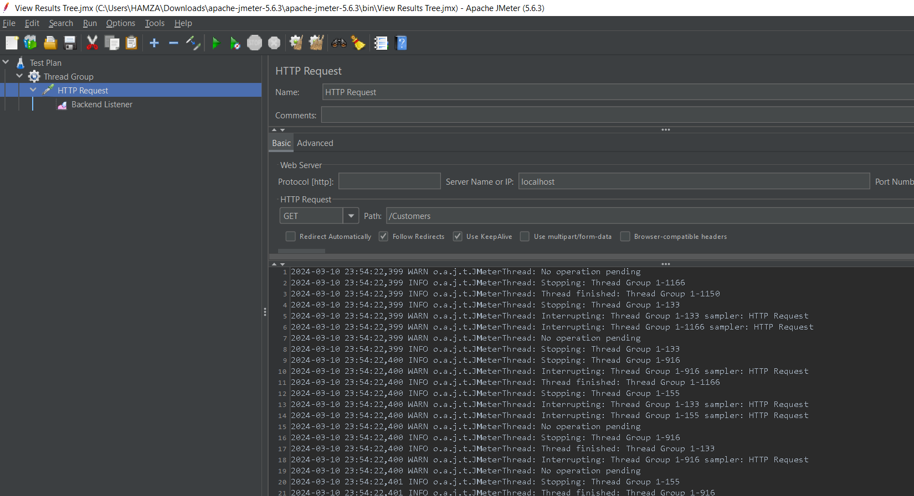

#Not yet finsihed
### Load Testing & Profiling and Monitoring the perfermance of Java Applications

JMeter: It's an open-source tool designed for load testing, performance testing, and functional testing of web applications. It allows you to simulate a heavy load on a server, group of servers, network, or object to test its strength or to analyze overall performance under different load types.

VisualVM: This is a visual tool integrating several command-line JDK tools and lightweight profiling capabilities. It's typically used for monitoring and troubleshooting Java applications. VisualVM provides detailed information about Java applications running on the Java Virtual Machine (JVM). It can be used for profiling CPU, memory, and threads.

Happy Coding !!! :))
Developed By  piko Dev => Hamza BRAIMI
